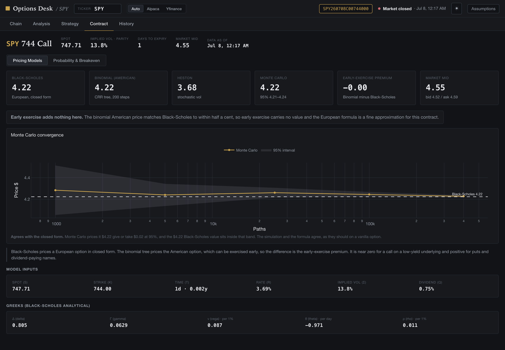
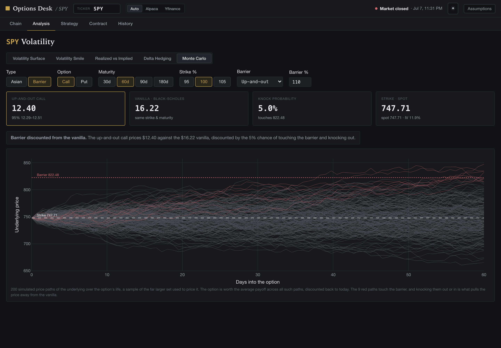
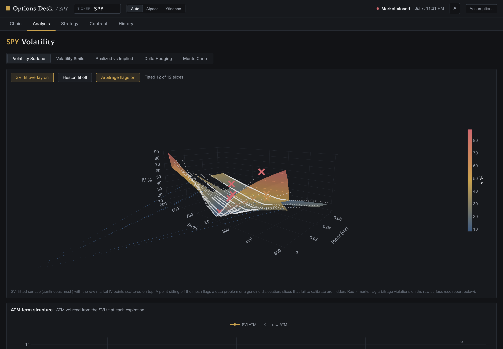
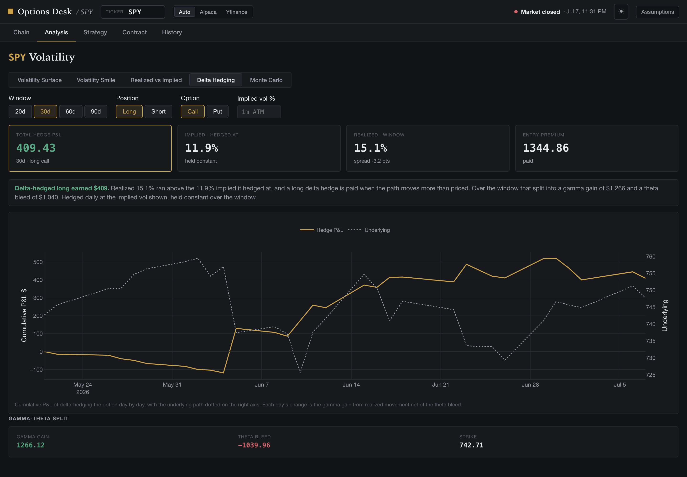
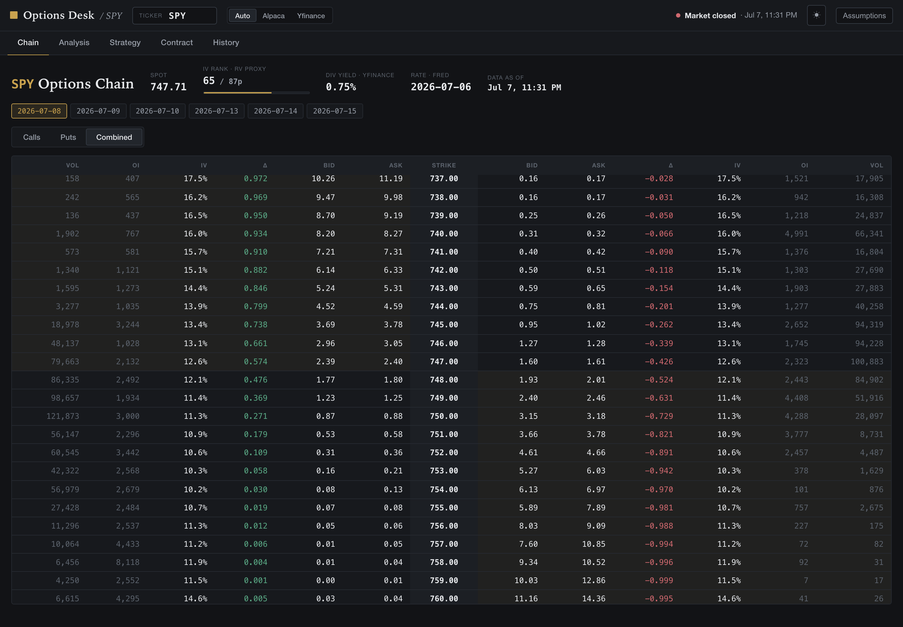
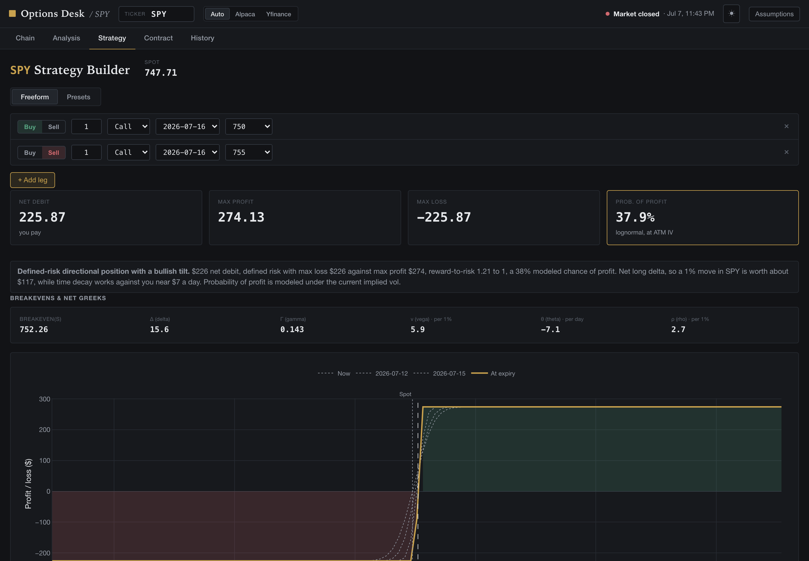

# Options Desk

An options pricing and volatility-analysis toolkit with a live-data interface. It
prices any listed contract by four independent methods, calibrates a Heston
stochastic-volatility model to the live surface, detects static arbitrage in the
smile, prices path-dependent exotics by Monte Carlo, and simulates delta-hedging
P&L against realized paths. The pricing library is pure Python, verified against
textbook and analytic benchmarks, and it drives a multi-page React interface built
for fast scanning of dense numbers. Everything runs locally on free market data.

---

## Screenshots

**A contract priced four ways (Black-Scholes, binomial, calibrated Heston, Monte
Carlo), with the Monte Carlo interval converging onto the closed form.**



**A barrier option by Monte Carlo. The price is the discounted expected payoff over
the simulated paths, and the red paths that breach the barrier are what discount it
below the vanilla.**



**The implied-volatility surface with a per-slice SVI fit over the raw market
points.**



**A delta-hedging simulation over a realized path, decomposed into gamma and theta.**



<details>
<summary>More screenshots</summary>

**Live chain with per-strike Greeks and IV.**



**Multi-leg strategy builder with a time-aware payoff diagram.**



</details>

---

## Pricing and models

**Vanilla pricing, four independent methods.**

- **Black-Scholes-Merton** closed form with continuous dividend yield and analytical
  Greeks, and a **Cox-Ross-Rubinstein** binomial tree (200 steps) for American early
  exercise, so the early-exercise premium is exposed directly. Verified against
  Hull's reference values and put-call parity to machine precision.
- **Heston (1993) stochastic volatility**, priced by Fourier inversion of the
  characteristic function on a fixed Gauss-Legendre quadrature, using the
  numerically stable "little trap" formulation (Albrecher, Mayer, Schoutens &
  Tistaert, 2007) so long-dated and LEAPS pricing does not jump the branch cut.
  Cross-checked against an independent full-truncation Euler Monte Carlo and the
  zero-vol-of-vol Black-Scholes limit.
- **Monte Carlo** under risk-neutral GBM with antithetic variates and a 95%
  confidence interval, shown converging onto the closed form as the path count
  grows.

**Heston calibration to the live surface.** The five parameters (v0, kappa, theta,
xi, rho) are recovered by nonlinear least squares (SciPy trust-region-reflective) on
relative price residuals across a maturity-diverse, wing-to-wing instrument set, so
the fit sees both the skew and the term structure. Fit quality is reported as an
implied-vol RMSE overall and per expiration, with the Feller condition flagged. It
degrades gracefully, returning unavailable rather than a distorted fit on a sparse
or crossed chain.

**Volatility surface and static arbitrage.**

- Raw market IV surface, with an **SVI raw-parameterization** overlay fit per
  expiration slice (Gatheral) and a **Heston-implied** overlay from the calibration.
- **Arbitrage detection** on the raw surface: calendar (total implied variance must
  be nondecreasing in maturity at fixed moneyness) and butterfly (call prices convex
  in strike, i.e. a nonnegative risk-neutral density), reported by location with a
  written report.
- ATM **term structure** extracted from the surface as a linked 2D view.

**Path-dependent exotics (Monte Carlo).** Arithmetic and geometric Asian options and
knock-in / knock-out barriers (up and down). Verified against the Kemna-Vorst
geometric-Asian closed form and barrier in-out parity. Each price is shown with the
cloud of simulated paths it is built from, the strike and barrier drawn in, and the
breaching paths highlighted.

**Delta-hedging simulation.** A self-financing daily hedge of an option over a real
historical path, marked through the engine, decomposed into its gamma gain and theta
bleed. It makes concrete that a delta-hedged option monetizes the spread between the
implied vol it was struck at and the realized vol the path delivers.

**Realized volatility and the variance risk premium.** Garman-Klass (1980) and
close-to-close estimators over standard windows, the ATM implied-minus-realized
spread, and a one-year realized-vol cone.

**Rates and dividends.** The risk-free rate is matched to each option's expiry by
interpolating the FRED Treasury constant-maturity curve, which controls rho error on
the longer-dated contracts where a single flat rate misprices. Dividend yield is
per underlying and user-overridable.

**Performance.** A NumPy port of the engine prices an entire chain's Greeks in one
array operation, reproducing the scalar engine element for element and benchmarked
at roughly 5x on the Greeks over a 2400-contract chain.

---

## Verification

Each component is pinned to a value it must reproduce, not to a golden output.

- **Black-Scholes and Greeks** against Hull; put-call parity to ~1e-15.
- **Vectorized engine** against the scalar engine, price to ~3e-14 and every Greek
  to ~1e-15 across a grid, implied vol identical.
- **Heston** against an independent Monte Carlo (within its standard error), the
  Black-Scholes limit, and the correct sign of the equity skew.
- **Heston calibration** recovers known parameters from synthetic prices to an
  IV-RMSE of zero, and degrades gracefully.
- **Monte Carlo**: the European interval brackets Black-Scholes and narrows toward
  it; the geometric Asian matches its closed form; barrier in-out parity holds
  (in + out = vanilla).
- **Delta-hedge economics**: a flat path bleeds exactly the premium, the vol spread
  sets the sign of the P&L, and gamma plus theta reconstructs the total.

```
python3 verify_engine.py         # Black-Scholes / binomial vs Hull
python3 verify_engine_vec.py     # vectorized engine vs the scalar engine
python3 verify_heston.py         # Heston vs Monte Carlo and the BS limit
python3 check_heston_calib.py    # calibration recovers known parameters
python3 check_montecarlo.py      # convergence, geometric Asian, barrier parity
python3 check_hedging.py         # hedge P&L economics
python3 benchmark_vec.py         # chain-pricing speedup
```

---

## Interface

Five pages, each with tabs, over a persistent top bar (ticker, IV source, market
status, and the pricing assumptions).

- **Chain.** Live chain per expiration with per-strike Greeks, IV, and an IV-rank
  readout.
- **Analysis.** Volatility Surface (3D, with the SVI and Heston overlays, arbitrage
  flags, and the term structure), Volatility Smile (with 25-delta risk reversal and
  butterfly), Realized vs Implied (VRP and the vol cone), Delta Hedging, and Monte
  Carlo (the exotics builder and path cloud).
- **Strategy.** Freeform and preset multi-leg builder with a time-aware payoff
  diagram, aggregate Greeks, breakevens, and probability of profit.
- **Contract.** One option priced four ways, with a probability and breakeven view.
- **History.** Key metrics per visit, stored locally and charted over time.

Each view carries a short, deterministic **read** that turns the numbers into a
directional interpretation, tied to a specific value with its assumption stated, and
never an explicit buy or sell.

---

## Quick start

Prerequisites: Python 3.11+ and Node.js 18+.

1. Copy `.env.example` to `.env` and add your Alpaca paper-trading keys (free).
   yfinance and the FRED rate curve need no key.
2. Run `./run.sh` (or double-click **Start Options Dashboard.command** on a Mac).

It builds a local environment on first run and opens the app at
`http://localhost:8000`, where the Python backend serves both the API and the built
interface. Nothing is hosted or uploaded.

---

## Architecture

- **Backend.** Python and FastAPI over a data layer (Alpaca for the live chain,
  quotes, and stock bars; yfinance for fallback IV and dividends; FRED for the rate
  curve), plus the pricing engine and analytics. It serves the JSON API and, in the
  packaged build, the web app.
- **Frontend.** React, Vite, TypeScript, Zustand, TanStack Query, and Plotly for the
  3D surface and interactive charts.
- **Storage.** A local SQLite file for examined-stock history.

Data sources were chosen for after-hours coverage: Alpaca serves after-hours IV and
Greeks through its free indicative feed (partial), and yfinance fills the rest, so
the surface and Greeks stay populated when the market is closed.

---

## Security

Alpaca keys live in `.env` (git-ignored) and are never committed. The paper keys
used in development were rotated. Read access to the chain and quotes is all that is
needed.

## License

MIT. See [LICENSE](LICENSE).
